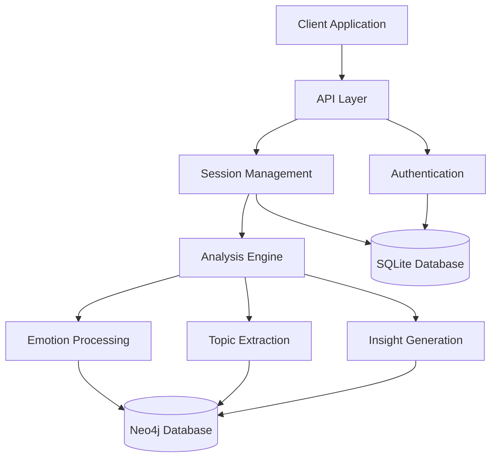
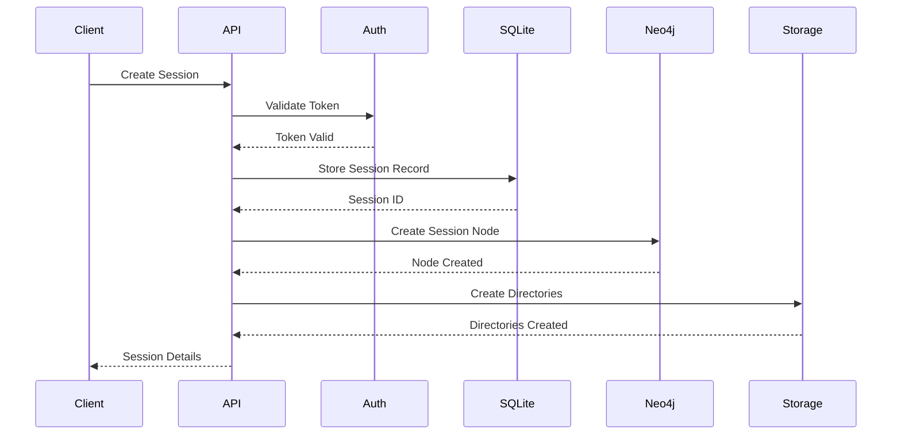
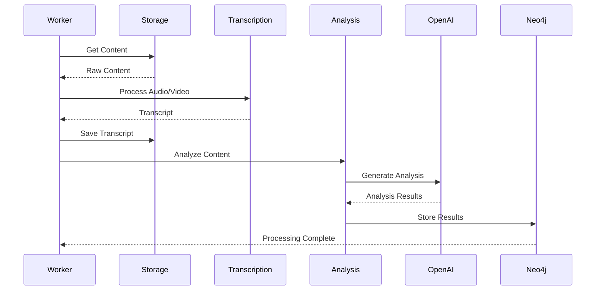
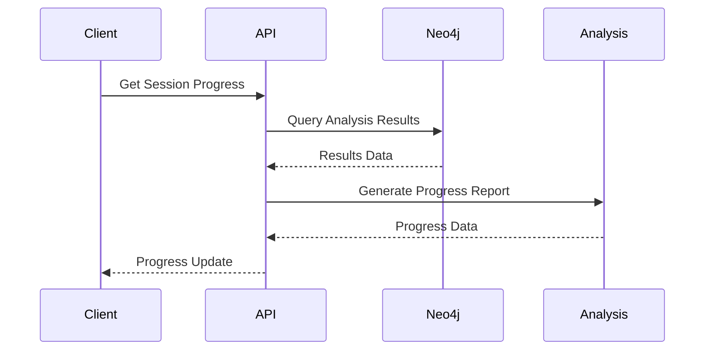

# System Architecture Overview

## Purpose
Insight Journey is a personal growth application that helps users track emotional patterns, insights, and personal development through AI-assisted reflection sessions. It analyzes user sessions to identify emotions, topics, beliefs, and action items.

## Core Components

### 1. User Management
- **Authentication**: JWT-based authentication with refresh tokens
- **User Settings**: Model preferences and analysis configuration
- **Admin Controls**: System settings and user management
- **Role-based Access**: Different permissions for admin and regular users

### 2. Session Processing
- **Recording**: Audio capture and transcription
- **Analysis**: AI processing using OpenAI
- **Storage**: Session data, elements, and relationships
- **Real-time Updates**: WebSocket-based progress tracking

### 3. Insight Generation
- **Element Extraction**: Emotions, topics, insights, beliefs, challenges, actions
- **Pattern Recognition**: Trends across sessions
- **Progress Tracking**: Action item follow-up
- **Taxonomy Classification**: Hierarchical organization of emotions and topics

## Component Interaction



## Key Technologies

1. **Backend**
   - Python Flask (API framework)
   - SQLAlchemy (ORM)
   - Neo4j Python Driver
   - PyJWT (Authentication)
   - OpenAI GPT (Analysis)

2. **Storage**
   - Neo4j (Graph Database)
   - SQLite (Relational Database)
   - File System (Media Storage)

3. **Communication**
   - REST API
   - WebSocket
   - JWT Authentication

## Core Workflows

### 1. Session Creation


### 2. Insight Generation


### 3. Progress Tracking


## Security Architecture

1. **Authentication**
   - JWT-based token system
   - Token refresh mechanism
   - Role-based access control

2. **Data Protection**
   - Encrypted storage
   - Secure file handling
   - API rate limiting

3. **Monitoring**
   - Health checks
   - Performance metrics
   - Error tracking

## Scalability

1. **Horizontal Scaling**
   - Stateless API design
   - Load balancing ready
   - Session persistence

2. **Performance Optimization**
   - Database indexing
   - Query optimization
   - Caching strategies

3. **Resource Management**
   - Connection pooling
   - Worker processes
   - Memory management

## Development Guidelines

1. **Code Organization**
   ```
   insight-journey/
   ├── api/           # API endpoints
   ├── core/          # Core business logic
   ├── models/        # Data models
   ├── services/      # External services
   ├── utils/         # Utilities
   └── tests/         # Test suite
   ```

2. **Best Practices**
   - RESTful API design
   - Clean architecture
   - Dependency injection
   - Comprehensive testing

3. **Development Workflow**
   - Feature branches
   - Code review process
   - CI/CD pipeline
   - Documentation updates 