# Core System Workflows

This document describes the core workflows in the Insight Journey platform.

## User Management

### Registration Flow
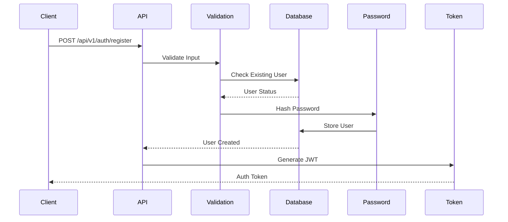

### Authentication Flow
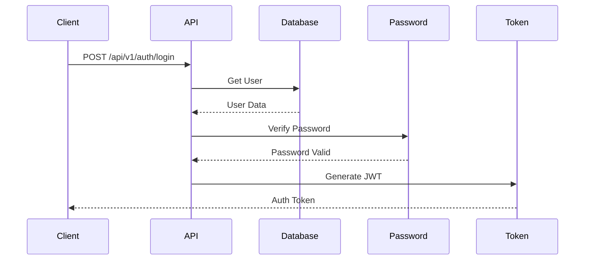

## Session Management

### Session Creation
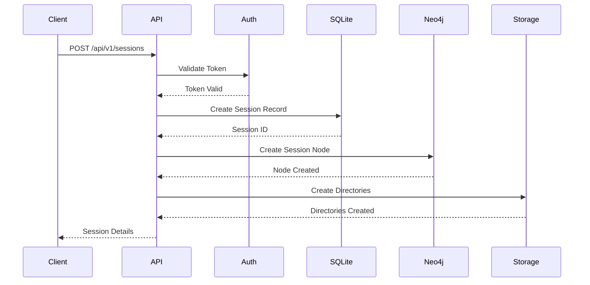

### Content Upload
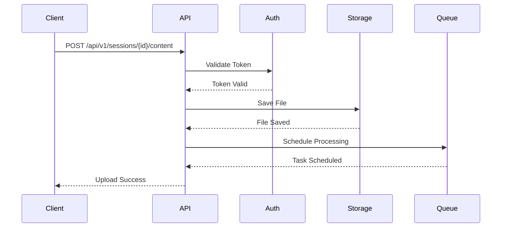

## Analysis Pipeline

### Content Processing
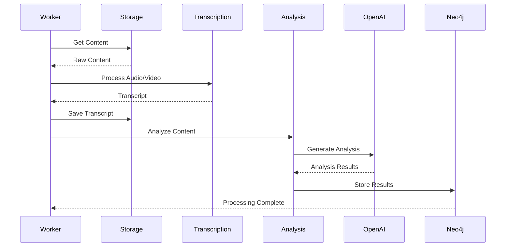

### Emotion Analysis
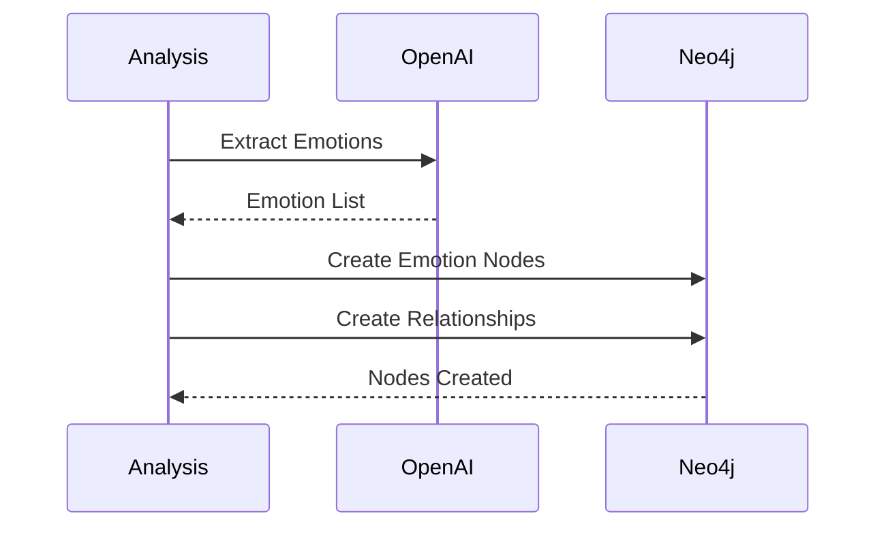

### Topic Analysis
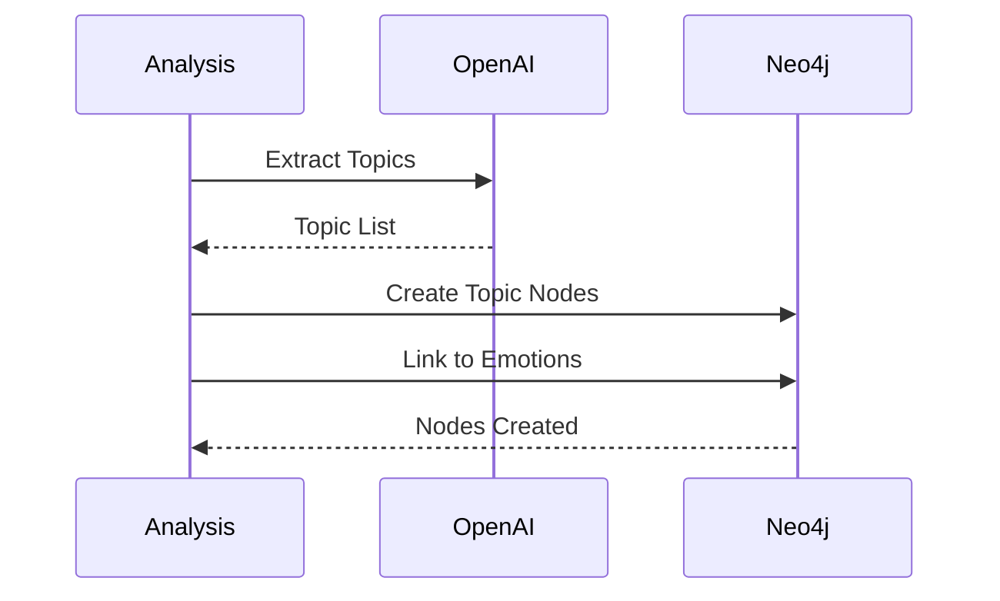

## Insight Generation

### Pattern Analysis
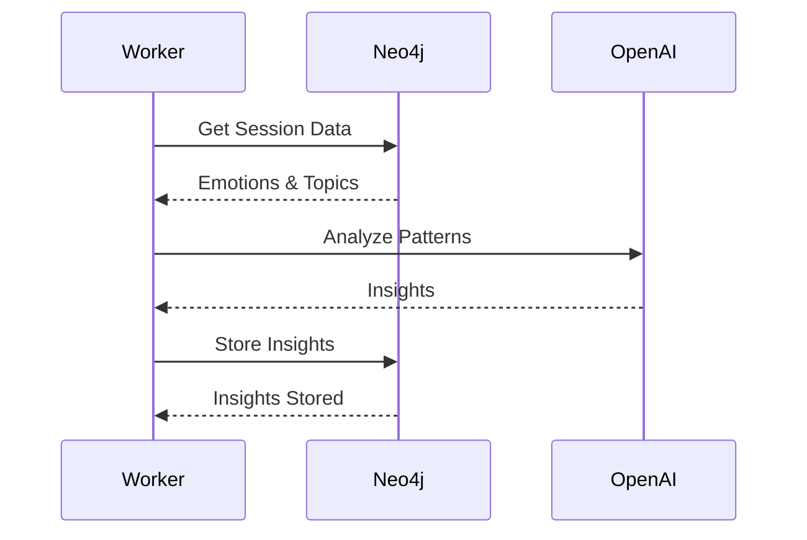

### Real-time Updates
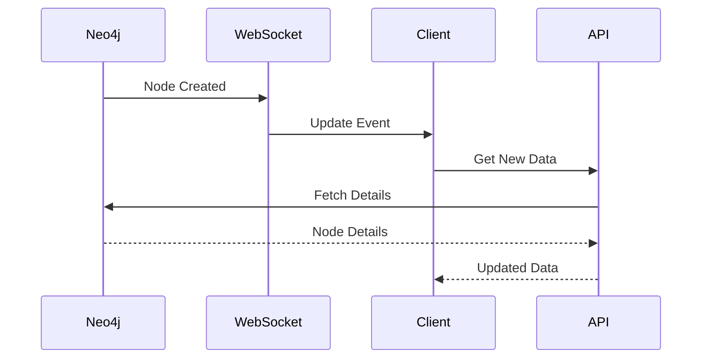

## Error Handling

### Error Recovery
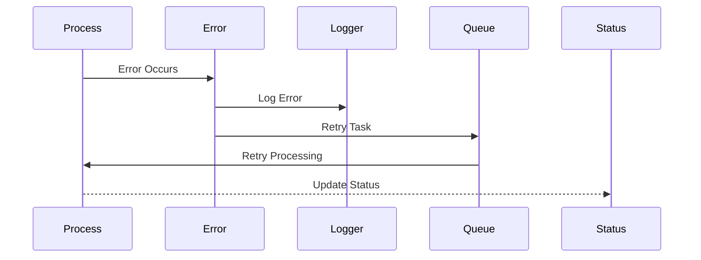

### Failure Notification
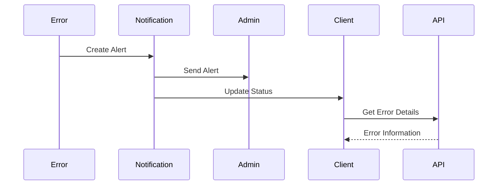

## Monitoring and Metrics

### Health Checks
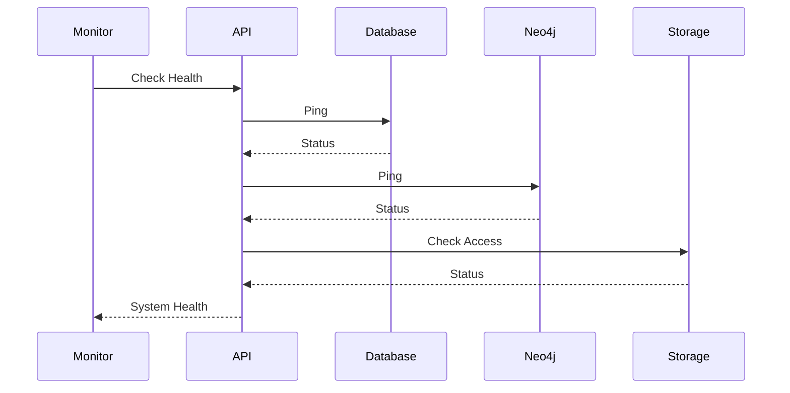

### Performance Metrics
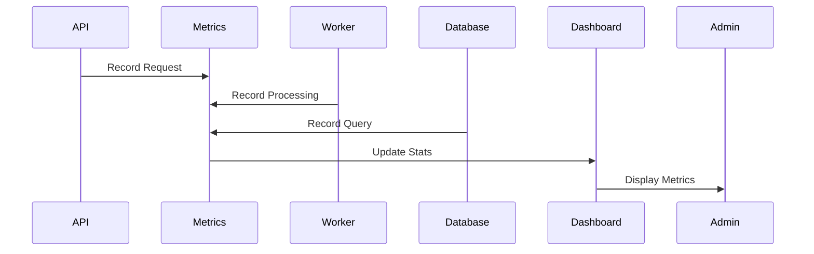

## Backup and Recovery

### Backup Process
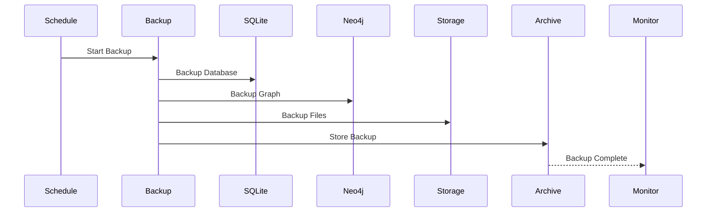

### Recovery Process
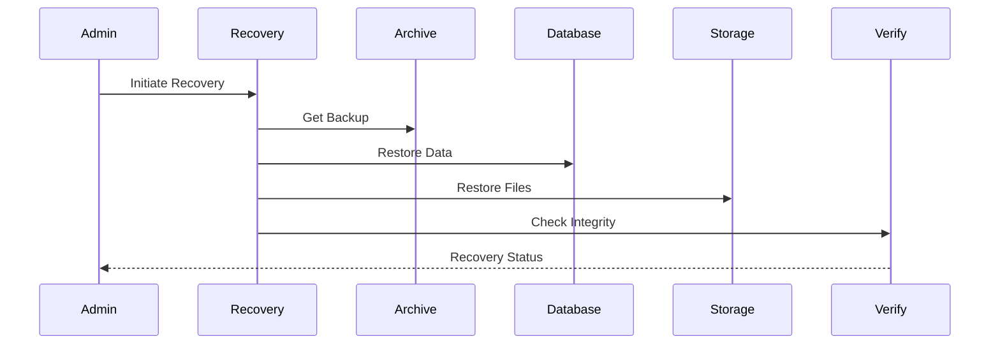